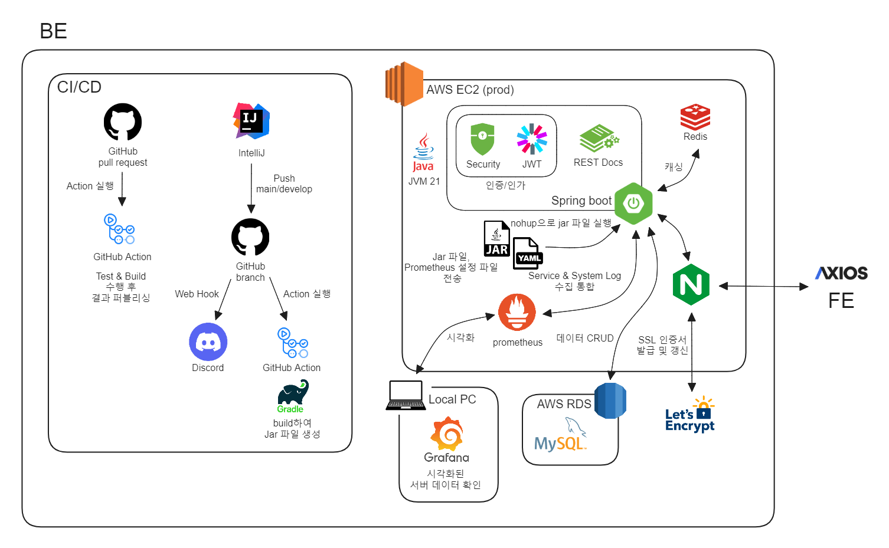
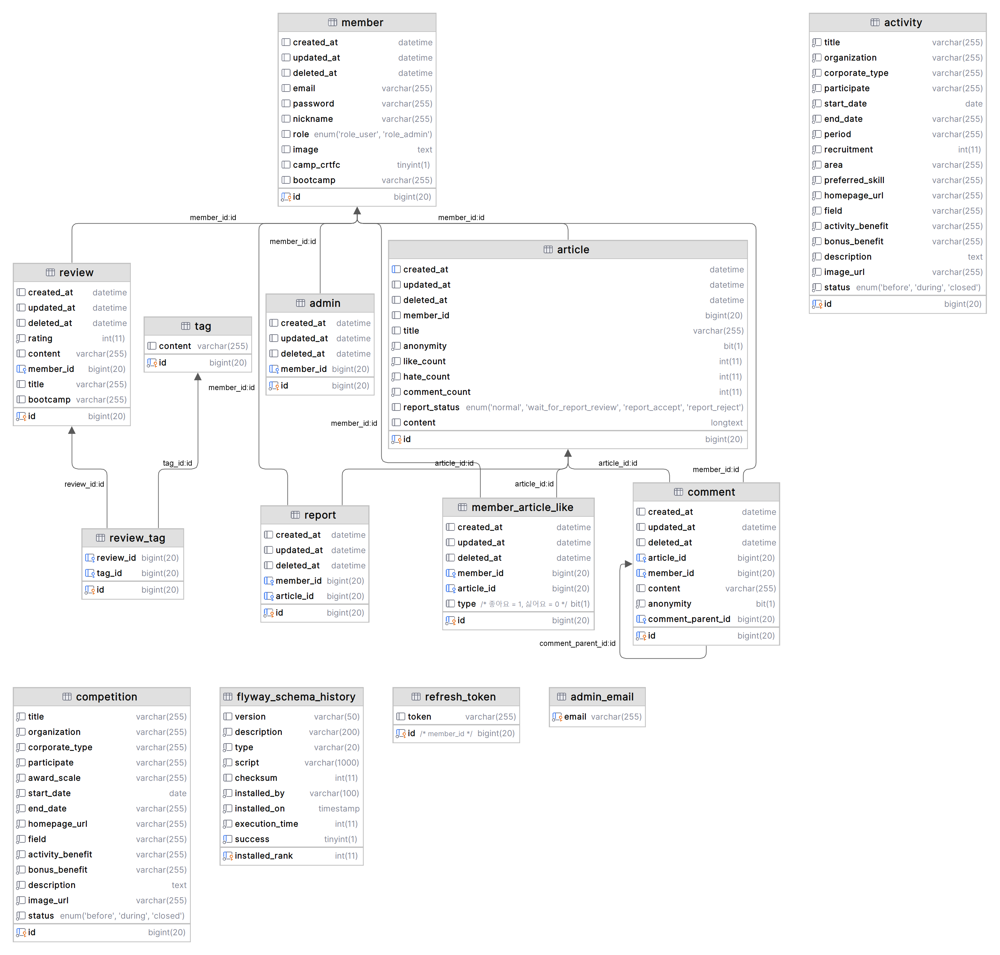

# Boocam : 부트캠프 수강생들의 종합 커뮤니티 Service

---

## 0. 목차

- [1. 프로젝트 설명](#1-프로젝트-설명)
    - [💁🏻 소개](#-소개)
    - [🎯 목적](#-목적)
    - [📚 기술 스택](#-기술-스택)
    - [⏰ 개발 기간](#-개발-기간)
    - [🧑🏻‍💻 팀원](#-팀원)
    - [✨ 기능](#-기능)
    - [🔗 배포 링크](#-배포-링크)
- [2. 설정](#2-설정)
- [3. 설계](#3-설계)
    - [📰 아키텍처](#-아키텍처)
    - [💾 DB 설계](#-DB-설계)
    - [📡 API 설계](#-API-설계)
- [4. API 문서](#4-API-문서)

---

## 1. 프로젝트 설명

### 💁🏻 소개

> 
> 
> 부트캠프 수강생들의 종합 커뮤니티 Service

### 🎯 목적

- **자유로운 소통**: 부트캠프 수강생들이 게시글과 댓글을 통해 익명/비익명으로 자유롭게 소통할 수 있습니다.
- **정보 제공**: 사용자는 도움이 될만한 IT 분야 대외 활동, 공모전 정보를 제공받을 수 있습니다.
- **자기소개서 공유**: 회원은 본인의 보유 스킬을 포함한 자기소개서를 공유하고 스터디 모집 시 이용할 수 있습니다. 
- **스터디 모집**: 회원은 스터디 모집 게시판을 이용하여 스터디를 모집 및 참여할 수 있습니다.

### 📚 기술 스택
- Language / Framework / Library 
  `Java` , `Spring Boot` , `Spring Security` , `JWT` , `Spring Data JPA` , `QueryDSL` , `Spring REST Docs`, `Selenium`
- Server / DB / Deployment 
  `AWS EC2` , `Ubuntu` , `AWS RDS` , `MySQL` , `Redis` , `GitHub Action CI/CD` , `Docker-compose`, `DB Flyway`, `Prometheus`
- Test / Collaboration Tools 
  `Junit5` , `Mockito` , `Git` , `Notion` , `Discord`

### ⏰ 개발 기간

- 2023-07-24 ~ 2023-11-09: v1 개발
- 2023-11-10 ~ 현재: v2 개발

### 🧑🏻‍💻 팀원

<table>
  <tr>
    <td align="center">
      <b>PM & Backend</b>
    </td>
    <td align="center">
      <b>Backend Leader</b>
    </td>
    <td align="center">
      <b>Backend</b>
    </td>
    <td align="center">
      <b>Backend</b>
    </td>
    <td align="center">
      <b>Backend</b>
    </td>
    <td align="center">
      <b>Backend</b>
    </td>
  </tr>
  </tr>
    <tr>
    <td align="center" width="150px">
      
    </td>
    <td align="center" width="150px">
      
    </td>
    <td align="center" width="150px">
      
    </td>
    <td align="center" width="150px">
      
    </td>
    <td align="center" width="150px">
      
    </td>
    <td align="center" width="150px">
      
    </td>
  </tr>
  <tr>
    <td align="center">
      <a href="https://github.com/chimaek" target="_blank">
        김승주
      </a>
    </td>
    <td align="center">
      <a href="https://github.com/ghrltjdtprbs" target="_blank">
        최혜미
      </a>
    </td>
    <td align="center">
      <a href="https://github.com/JeongUijeong" target="_blank">
        정의정
      </a>
    </td>
    <td align="center">
      <a href="https://github.com/KwonJuHwan" target="_blank">
        권주환
      </a>
    </td>
    <td align="center">
      <a href="https://github.com/Nine-JH" target="_blank">
        구자현
      </a>
    </td>
    <td align="center">
      <a href="https://github.com/Kongji82" target="_blank">
        공지혁
      </a>
    </td>
  </tr>
</table>

### ✨ 기능

- **V1 기능**
    - 회원
        - 인증 번호 이메일 전송/확인
        - 회원 가입/로그인/탈퇴
        - 회원 정보 조회/수정, 비밀번호 재설정
    - 게시글
        - 게시글 등록/수정/삭제
        - 게시글 검색
        - 게시글 목록 조회/상세 정보 조회
    - 댓글
        - 댓글/대댓글 등록/수정/삭제
        - 댓글 목록 조회
    - 좋아요/싫어요
        - 게시글 좋아요/싫어요 등록/조회/취소
        - 좋아요/싫어요 캐싱
    - 신고
        - 게시글 신고 등록
    - 관리자
        - 관리자 회원 가입
        - 신고 게시물 목록 조회/상세 정보 조회
        - 신고된 게시물 복구/삭제
    - 기타
        - 로깅 디스코드 웹훅
- **V2 추가 기능**
    - 회원
        - 인증/인가 스프링 시큐리티 적용
        - 토큰 재발급
    - 부트캠프 후기
        - 후기 등록/조회/수정/삭제
        - 부트캠프별 후기 요약 조회
        - 부트캠프 후기 태그 통계 조회
    - 대외활동/공모전
        - 대외활동/공모전 크롤링 및 스프링 배치
        - 대외 활동 목록 조회/상세 정보 조회
        - 공모전 목록 조회/상세 정보 조회
    - 자기소개서
        - 자기소개서 등록/목록 조회/상세 정보 조회/수정/삭제
    - 기타
        - DB flyway 도입
        - Actuator, prometheus 도입

### 🔗 배포 링크

- BE
    - dev: https://api-dev.boocam.net/docs/index.html
    - prod: 🚧준비중🚧
- FE: https://www.boocam.net/

## 2. 설정

- 자바 버전: 21
- 스프링 버전: 6.1.2
- 스프링 부트 버전: 3.2.1
- 의존성
    - Spring Web
    - security, JWT
    - Lombok
    - Spring REST Docs
    - Spring Data Jpa
    - Spring Data Redis
    - Validation
    - QueryDSL
    - Spring Mail
    - Spring Cloud
    - String Actuator
    - Prometheus
    - Selenium
    - Spring AOP

---

## 3. 설계

### 📰 아키텍처

> 

### 💾 DB 설계

`ERD`
> 

### 📡 API 설계

[Spring REST Docs](#4-API-문서)를 통해 확인하실 수 있습니다.

---

## 4. API 문서

※ Spring REST Docs로 문서화했습니다.
- dev: https://api-dev.boocam.net/docs/index.html
- prod: 🚧준비중🚧